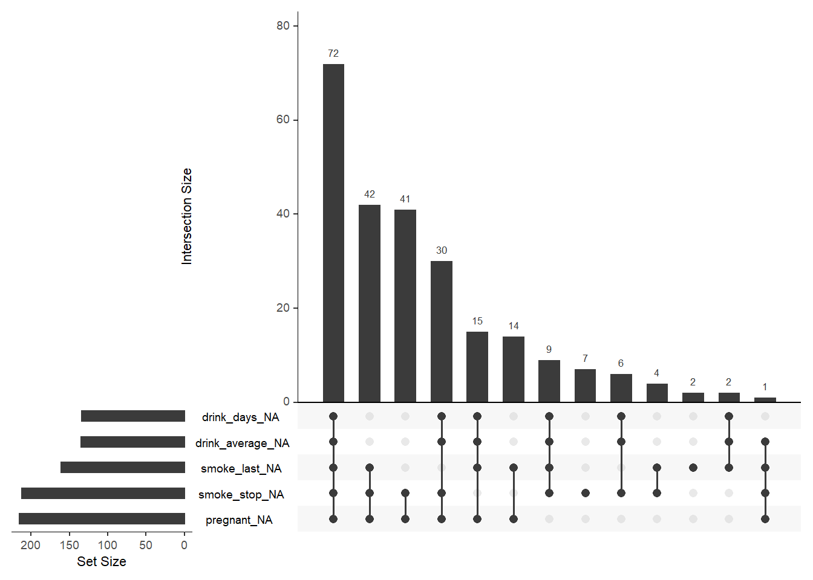
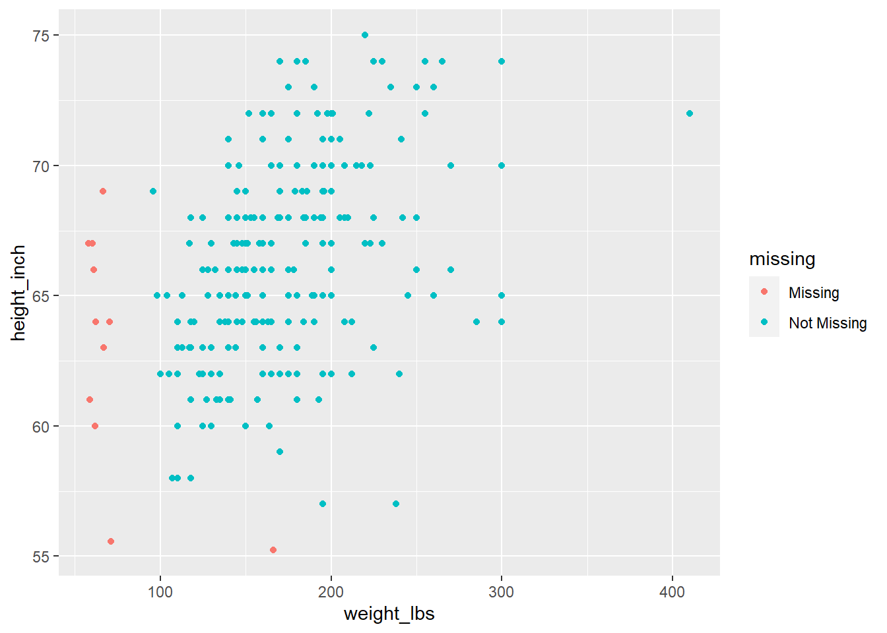

# Visualizing missing data 

Largely based on contributions from this SO [thread](https://stackoverflow.com/questions/8317231/elegant-way-to-report-missing-values-in-a-data-frame)

## Example data

Using `riskfactors` dataset from `naniar` package.  


```r
data(riskfactors, package = "naniar")
```


```r
str(riskfactors)
```

```
## Classes 'tbl_df', 'tbl' and 'data.frame':	245 obs. of  34 variables:
##  $ state           : Factor w/ 52 levels "1","2","5","6",..: 22 36 52 38 28 15 40 50 14 5 ...
##  $ sex             : Factor w/ 2 levels "Male","Female": 2 2 2 1 2 1 1 2 1 2 ...
##  $ age             : int  49 48 55 42 66 66 37 62 38 42 ...
##  $ weight_lbs      : int  190 170 163 230 135 165 150 170 146 260 ...
##  $ height_inch     : int  64 68 64 74 62 70 68 70 70 73 ...
##  $ bmi             : num  32.7 25.9 28 29.6 24.7 ...
##  $ marital         : Factor w/ 6 levels "Married","Divorced",..: 1 2 1 1 3 1 1 5 1 4 ...
##  $ pregnant        : Factor w/ 2 levels "Yes","No": NA NA NA NA NA NA NA NA NA 2 ...
##  $ children        : int  0 0 0 1 0 0 3 0 2 3 ...
##  $ education       : Factor w/ 6 levels "1","2","3","4",..: 6 5 4 6 5 5 6 6 4 5 ...
##  $ employment      : Factor w/ 7 levels "1","2","3","4",..: 2 1 5 1 1 6 2 6 1 3 ...
##  $ income          : Factor w/ 10 levels "<10k","10-15k",..: 6 6 1 8 7 6 8 1 7 3 ...
##  $ veteran         : Factor w/ 5 levels "1","2","3","4",..: 5 5 5 5 5 3 5 5 5 5 ...
##  $ hispanic        : Factor w/ 2 levels "Yes","No": 2 2 1 2 2 2 2 2 2 2 ...
##  $ health_general  : Factor w/ 6 levels "Excellent","VeryGood",..: 3 4 4 1 1 1 2 5 5 3 ...
##  $ health_physical : int  3 4 0 0 0 0 0 30 30 0 ...
##  $ health_mental   : int  15 30 0 0 0 0 0 30 30 20 ...
##  $ health_poor     : int  2 3 NA NA NA NA NA 30 14 4 ...
##  $ health_cover    : Factor w/ 2 levels "Yes","No": 1 1 1 1 1 1 1 2 1 1 ...
##  $ provide_care    : Factor w/ 2 levels "Yes","No": 2 2 2 2 2 2 1 2 2 2 ...
##  $ activity_limited: Factor w/ 2 levels "Yes","No": 1 2 2 2 2 2 2 2 1 NA ...
##  $ drink_any       : Factor w/ 2 levels "Yes","No": 2 2 2 1 2 2 1 2 2 NA ...
##  $ drink_days      : int  NA NA NA 15 NA NA 2 NA NA NA ...
##  $ drink_average   : int  NA NA NA NA NA NA 2 NA NA NA ...
##  $ smoke_100       : Factor w/ 2 levels "Yes","No": 2 2 2 2 1 2 2 1 1 1 ...
##  $ smoke_days      : Factor w/ 3 levels "Everyday","Somedays",..: NA NA NA NA 1 NA NA 3 1 3 ...
##  $ smoke_stop      : Factor w/ 2 levels "Yes","No": NA NA NA NA 1 NA NA NA 1 NA ...
##  $ smoke_last      : Factor w/ 6 levels "3","4","5","6",..: NA NA NA NA NA NA NA 5 NA 3 ...
##  $ diet_fruit      : int  1095 52 36 NA -7 24 52 156 24 NA ...
##  $ diet_salad      : int  261 209 156 NA 261 52 156 24 84 NA ...
##  $ diet_potato     : int  104 52 52 NA 209 104 24 52 144 NA ...
##  $ diet_carrot     : int  156 0 24 NA 261 52 24 104 24 NA ...
##  $ diet_vegetable  : int  521 52 24 NA 365 365 730 365 0 NA ...
##  $ diet_juice      : int  12 0 24 NA 104 365 104 0 0 NA ...
```


## `naniar` package


```r
library(naniar)
library(ggplot2)
```

### Upset plot


```r
gg_miss_upset(riskfactors)
```



### Scatterplot with missings


```r
ggplot(riskfactors,
       aes(x = weight_lbs,
           y = height_inch)) +
 geom_miss_point()
```




```r
gg_miss_fct(x = riskfactors, fct = marital)
```


